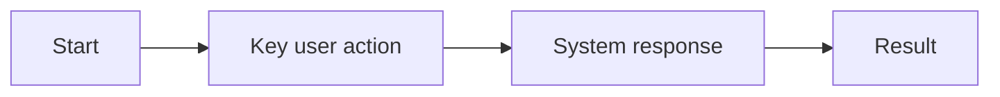

<!-- Template for docs/PROJECT.md, used by the 7-documentation skill. -->

# Project - Features

**Last updated:** YYYY-MM-DD
**Features implemented:** <count>

---

## PROJ-<X>: <theme>

**Status:** <development | QA-passed | production>
**Purpose:** <one-sentence user/business goal from concept>
**Scope:** <what is included and intentionally excluded>

### Capabilities

- <user-facing thing the app can now do>
- <another capability>

### Primary Workflow

1. <human workflow step>
2. <human workflow step>
3. <outcome>

### User Stories Implemented

- PROJ-<X>-PRD-1-US-1: <title>
- PROJ-<X>-PRD-1-US-2: <title>

### Notes

- **PRDs:** [PRD-1](../specs/PROJ-<X>-<theme>/2_PRDs/PRD-1-<desc>.md)
- **QA:** <pass/bugs/residual-risk summary from QA Results>
- **Known limits:** <only if source-backed>
