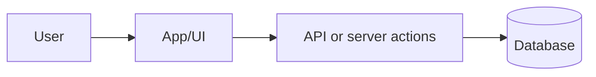
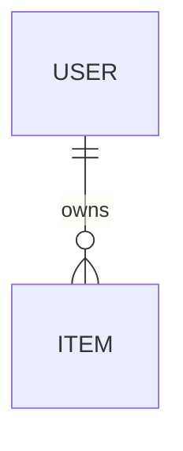
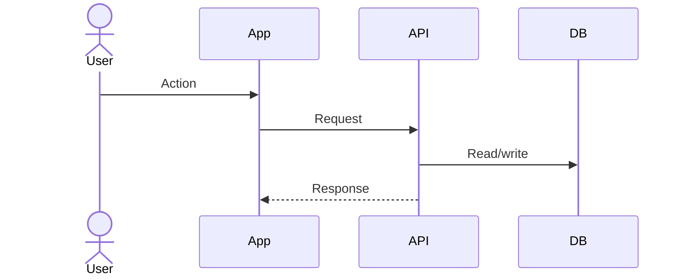

<!-- Template for docs/TECHNICAL.md, used by the 7-documentation skill. -->

# Technical Reference

**Last updated:** YYYY-MM-DD

## System Overview

<short explanation of runtime shape and major modules>



## Architecture

<high-level architecture from PROJ architecture files>

## Technology Choices

| Area | Choice | Why it matters |
|---|---|---|
| Frontend | <tool> | <reason> |
| Data | <tool> | <reason> |

## Data Model

<entities, relationships, ownership, important constraints>



## Data Flows

### <Flow Name>

<when this flow happens and why>



## Integrations and External Services

<APIs, auth providers, storage, payment, queues, model providers, email, analytics>

## Directory Structure

```text
src/
  app/       - <what lives here>
  features/  - <what lives here>
  lib/       - <what lives here>
```

## Dependencies

<runtime and dev dependencies with purpose, especially newly introduced ones>

## Deployment and Runtime

<provider, build command, env-var overview, persistence/runtime constraints>

## Operational Notes and Gotchas

<source-backed notes from agent.md, QA, post-wave notes, and retrospective>
